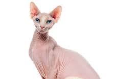

# About Me

**Name: Christopher Rebollar-Ramirez** \
I love to program in C++ and in Python. I also love cats. Here are some of my favorite things about cats.

This is the first line of code I have ever written.
```
std::cout << "Hello World" << std::endl
```
> The first language I learned was C++. I then went on in learning Python, Java, and database languages.

## Anyways, here are pictures and information I like about cats

### Siamese Cat


### Sphynx Cat


## Here is more information about cats


[More on cats](factsoncats.md)

[How to pet a cat](petcat.md)

[More pictures on cats](https://pixabay.com/images/search/cat/)

Cat I seem in person:
- [X]  Black cat
- [ ]  British Shorthair
- [ ]  Maine Coon
- [X]  Persian Cat
- [ ]  Ragdoll
- [ ]  Sphynx Cat